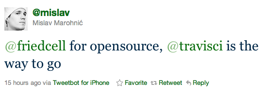

!SLIDE
# Now

!SLIDE bullets
# Facts!
* 3 500 Repositories
* 74 000 Commits
* 210 000 Builds

!SLIDE bullets strike-through
# Facts!
* 3 500 Repositories
* 74 000 Commits
* 210 000 Builds

!SLIDE bullets
# Facts!
* 3 800 Repositories
* 77 000 Commits
* 277 000 Builds

!SLIDE bullets
# Users?
* RSpec, Cucumber, Devise, Mocha, ...

!SLIDE bullets
# Who else?
* Compass, Sprockets, OmniAuth, Mongoid, ...

!SLIDE bullets
# Wow!
* Json, Webmock, CanCan, Whenever, ...

!SLIDE bullets
# Amazing!
* Guard, Oauth2, Yard, SimpleCov, ...

!SLIDE bullets gosh
# GOSH
* github-services slimgems railscasts diaspora couch\_potato active\_admin birthday
* simple\_form ruby-on-rails-tmbundle liquid execjs jenkins.rb nifty-generators active\_merchant
* grape request-log-analyzer refinerycms koala linguist htty vcr nested_form oauth2 savon ruby-warrior
* communityengine i18n uglifier engineyard multi_json phony octokit pusher-gem parslet split globalize3
* cloudist squeel russian themes\_for\_rails whois make_resourceful routing-filter girl\_friday tire
* rack-protection boom blather linkedin fabrication money curb restfulie chunky_png slop
* faraday ripple serve celluloid stamp broadcast forem mongoid-tree tabtab nyan-cat-formatter

!SLIDE bullets
# By the way ...
* Rails, Rubinius, Rubygems, Bundler

!SLIDE bullets
# And ...
* that's just the beginning.

!SLIDE bullets
# Today
* Erlang
* Closujre
* PHP
* Node.js

!SLIDE bullets
# Real soon
* Python
* Cocoa

!SLIDE bullets center tweets love
# LOVE

!SLIDE bullets sponsors
# Sponsors
* 
  
  
  
  
  
  
  
  

